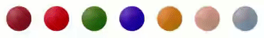

# react-bulb
A colorful boolean indicator for React.

<p align="center">
  
</p>

## 🚀 Getting Started

Using [`npm`]():

```bash
npm install --save react-bulb
```

Using [`yarn`]():

```bash
yarn add react-bulb
```

## ✍️ Example

```javascript
import React from 'react';
import Bulb from 'react-bulb';

export default () => (
  <Bulb
    size={60}
    color="green"
  />
);
```

## 📌 Props
-----
Prop                  | Type     | Default                   | Required
--------------------- | -------- | ------------------------- | --------
style|shape[object Object]|Object.freeze({})|No
size|number|40|No
color|string|'red'|No

## ✌️ License
[MIT](https://opensource.org/licenses/MIT)
